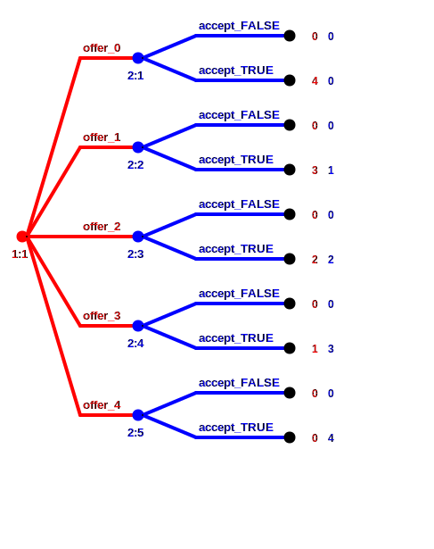
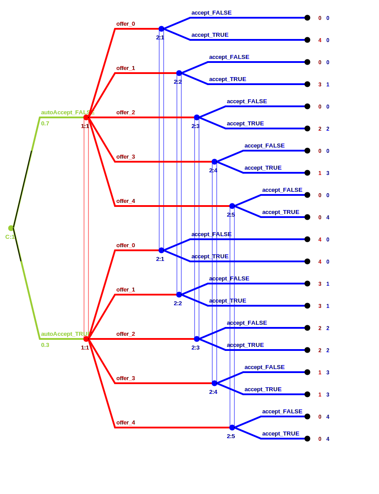

```{r setup, include=FALSE}
knitr::opts_chunk$set(echo = TRUE, error=TRUE)
library(gtreeCore)
```

## Specifying a game

First, we load the `gtreeCore` library that contains all functions to use gtree from R, but no shiny GUI. We also define a small simple Ultimatum game with the function `new.vg`.

```{r}
library(gtreeCore)
vg = new.vg(
  gameId = "UltimatumGame",
  params = list(numPlayers=2, cake=4),
  stages = list(
    stage("proposerStage",
      player=1,
      actions = list(
        action("offer",~0:cake)
      )
    ),
    stage("responderStage",
      player=2,
      observe = "offer",
      actions = list(
        action("accept",c(FALSE,TRUE))
      )
    ),
    stage("PayoffStage",
      player=1:2,
      compute=list(
        payoff_1 ~ ifelse(accept, cake-offer,0),
        payoff_2 ~ ifelse(accept, offer,0)
      )
    )
  )
)
```


The `gameId` should be a unique name of the game. This is relevant if we want to conveniently save results, like computed equilibria, in the default folder structure used by `gtree`.

We then define a list of parameters `params`. Parameters can be referenced to in later definitions of the game. Note that you must *always* specify the number of players in a parameter called `numPlayers`. We also specify the size of the `cake` that can be distributed between the proposer and responder in the game.

Heart of our definition is a list of 3 `stages`. Each stage in the list should be generated with the function `stage` that sets defaults and transforms all formulas into a canoncial format.

1. In the first stage is named `proposerStage`. The argument `player=1`, specifies that player 1 acts here.
She chooses an action `offer`, that is created with the function `action` and element of a list `actions`. The function action first requires a name and then a set of possible values the action can take. Here we specify the set as a formula `~ 0:cake`. This means we compute the action set based on the specified parameters and possibly based on previously computed variables including chosen action values or realized moves of nature.<br>
Alternatively, we could also provide a fixed action set without formula e.q. `0:4`. This can not contain references to parameters or variables of the game and is always fixed when the game is created.

2. In the second stage player 2, observes the offer. This is specified by the argument `observe="offer"`. The argument observe specifies all observed variables as a simple character vector, or remains `NULL` if nothing is observed.<br>
Player 2 then decides whether to accept the action or not. Here we have chosen the fixed action set `c(FALSE,TRUE)`. You could encode specify the set for accept in a different way, e.g. as a character vector `c("reject","accept")` or an integer vector `c(0,1)`. 


3. The third stage just computes variables as specified by the list provided for the field `compute`. You can briefly specify a computation with the formula syntax `name ~ formula`.  Note that for each player `i` you must compute somewhere in your game the variable `payoff_i`, like `payoff_1` and `payoff_2`, that specifies the (monetary) payoff for that player. We can later easily transform these monetary payoffs, using some alternative outcome based utility function, e.g. to account for inequality aversion or loss aversion.
<br>You can use any vectorized, deterministic R function to specify a computed variable. Random variables must be declared separately, as a move of nature, however (see further below). Here we use the function `ifelse` for a simple distinction of two cases. For distinguishing more than two cases the functions `cases` in `gtreeCore` provides a simple syntax. Note that we could have more compactly written:
`payoff_1 ~ (cake-offer)*accept` and `payoff_2 ~ offer*accept`
<br>For computing equilibria, it does not really matter which players you specify a stage in which no action takes place. However, `gtree` also has (currently rudimentary) features to run a game as a web-based experiment. When running as an experiment, a stage will be shown to all players that are specified in the `players` field. If an action is taken in a stage, exactly ONE player must be specified. For stages without actions, you can specify any number of players including no player.

We can get a short overview of a specified game by typing its variable name in the R console.
```{r}
vg
```

Note that the abbreviation `vg` stands for `variant game`. If you use the GUI, you can also specify different variants of a game in a single game tree that may differ by their parameters, or other elements. A variant game is the distilled game tree for one particular variant. In the R interface, we will always directly specify games for single variants.


## Table-form representation

Before we can solve for equilibria of a game, we have to create a table-form representation of the game using the function `vg.to.tg`.

```{r}
tg = vg.to.tg(vg)
```

Briefly spoken a table form game describes the extensive form of the game using several data frames. While this representation uses more memory than common tree representations like nested lists or linked lists, it benefits from R's ability (strongly enhanced by the `dplyr` and `data.table` packages) to quickly manipulate tabular data.
A detailed explanation of the internal structure of the different game representations is given in another vignette. 

The game tree of our ultimatum game looks as following:

```{r include=FALSE}
tg.to.efg(tg, path=getwd())
```
(To generate such a graphical representation of the game tree, use the function `tg.to.efg` to export the game to Gambit's extensive form game format and open the file with the [Gambit GUI](http://www.gambit-project.org/).)

We can get some basic information about the extensive form representation by printing the `tg` variable.
```{r}
tg
```
We see that there are 10 possible outcomes, i.e. terminal nodes of the game tree. Player 1 has a single information set, and player 2 has 5 information sets (one for each possible observed offer).

Recall that a pure strategy for player i, specifies a move for each of the players information set. While player 1 has thus only 5 different pure strategies, player 2 has 2^5=32 pure strategies. A pure strategy of player 2 specifies for each of the 5 possible offers whether to accept or reject. Hence, we have a total 5*32=160 pure strategy profiles in this small ultimatum game.

This game also has 6 different subgames. Solving for subgame perfect equilibria via backward induction, we effectively only have to look at 15 different strategy profiles. 

## Solving for equilibria

The following code solves for all pure strategy subgame perfect equilibria (SPE) of the game using the internal gtree solver.
```{r}
eq.li = gtree.solve.spe(tg)
length(eq.li) # no of equilibria
eq.li
```
The ultimatum game has 2 pure SPE. Yet, the equilibria are returned in a representation that is hard to interpret directly, but suitable for further transformation.

The following code shows the equilibrium outcomes, i.e. all actions and computed variables on the equilibrium path. 
```{r}
eq.li.outcomes(eq.li,tg = tg)
```
In the first equilibrium the proposer offers 1 unit, in the second 0 units.

The following code shows a table representation of each equilibrium that allows us also to see the chosen actions off the equilibrium path.
```{r}
eq.li.tables(eq.li, tg=tg)
```
We see that in the first equilibrium, an offer of 0 is rejected, while all other offers are accepted. Correspondingly, the equilibrium offer is 1. In the second, equilibrium all offers are accepted and the equilibrium offer is thus 0.

## Setting different utility functions

So far we assumed that the specified payoffs `payoff_1` and `payoff_2` are equal to players' utility. One motivation for gtree is to conveniently solve games for different specifications of players' preferences that can account e.g. for inequality aversion or loss aversion.

While in principal one could account for different outcome based preferences, by directly adapting the formulas for `payoff_1` and `payoff_2` in the game definition, we prefer a slightly different approach.

In the preferred approach the specified payoffs in the game definition are interpreted as monetary or material payoffs. This means games created by `new.vg` can very closely match the structure of economic experiments, for which we only know the specified monetary payoffs. 

After the game is specified, we can use the function `set.tg.util` to specify a utility function for which we want to find equilibria.

For example, consider the following inequality avversion utility function (Fehr and Schmidt, ????)
\[
u_i = \pi_i 
  - \alpha \frac {1}{n-1}\sum_{j \ne i} \max(\pi_j - \pi_i,0)
  + \beta \frac {1}{n-1}\sum_{j \ne i} \max(\pi_i - \pi_j,0)
\]
where \pi denotes material utilities.

The following code sets this utility function with an envy parameter of $\alpha=1$ and a guilt aversion parameter of $\beta=0.5$ and solves for subgame perfect equilibria:
```{r}
util.funs = ineqAvUtil(player = 1:2,alpha = 1, beta=0.5)
set.tg.util(tg, util.funs)
eq.li = gtree.solve.spe(tg)
eq.li.tables(eq.li,tg)
```


## Moves of Nature

```{r}
library(gtreeCore)
vg = new.vg(
  gameId = "UltimatumGame",
  params = list(numPlayers=2, cake=4),
  stages = list(
    stage("autoAcceptStage",
      nature=list(
        natureMove("autoAccept", c(FALSE,TRUE),probs = c(0.7,0.3))
      )
    ),
    stage("proposerStage",
      player=1,
      actions = list(
        action("offer",~0:cake)
      )
    ),
    stage("responderStage",
      player=2,
      observe = "offer",
      actions = list(
        action("accept",c(FALSE,TRUE))
      )
    ),
    stage("PayoffStage",
      player=1:2,
      compute=list(
        payoff_1 ~ ifelse(accept | autoAccept, cake-offer,0),
        payoff_2 ~ ifelse(accept | autoAccept, offer,0)
      )
    )
  )
)
```


Since autoAccept is drawn at the beginning of the game and not observed 
by anybody, we only have a single subgame.
```{r}
tg = vg.to.tg(vg)
tg
efg = tg.to.efg(tg,file = NULL)
```

```{r}
eq.li = gtree.solve.spe(tg)
length(eq.li)
```

```{r}
eq.tables(eq.li[[29]],tg)
```


# Internal representation


